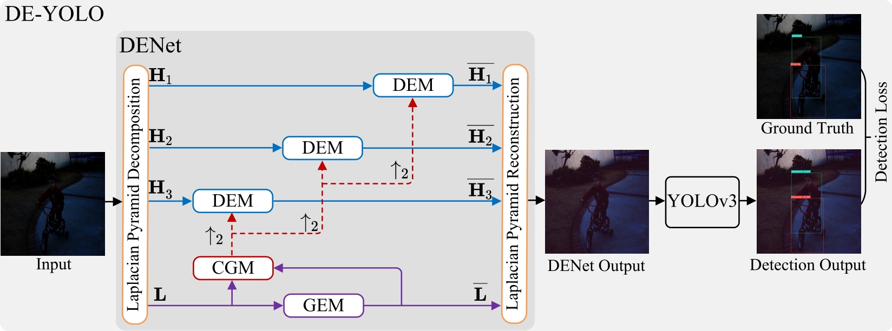

# DE-YOLO
# PyTorch code for our ACCV2022 paper "DENet: Detection-driven Enhancement Network for Object Detection under Adverse Weather Conditions"



## Dependencies
* python==3.7.5
* torch==1.7.1
* torchvision==0.8.2
* tensorboard==2.5.0
* numpy==1.19.5
* opencv-python==4.2.0.34
  
```bash
cd DE-YOLO 
pip install -r ./requirements.txt
```

## Datasets and Models
Please download the processed datasets and pretrained models from the anonymous Github links below.

[RTTS](https://github.com/NIvykk/research_demo/releases/download/V1.0/RTTS.zip) 
[ExDark](https://github.com/NIvykk/research_demo/releases/download/V1.0/ExDark.zip)
[Pretrained Models](https://github.com/NIvykk/research_demo/releases/download/V1.0/pretrained_models.zip)

## Folder structure
Download the datasets and pretrained models first. Please prepare the basic folder structure as follows.

```bash
/parent_folder
  /datasets   # folder for datasets 
    /RTTS
    /ExDark
    ...
  /DE-YOLO
    /data     # config files for datasets
    /models   # python files for DE-YOLO
    /pretrained_models  # folder for pretrained models
    requirements.txt
    README.md
    ...
```

## Quick Test
### Evaluation on real-world low-light images from ExDark 
```bash  
# put datasets and pretrained model in the corresponding directory 
cd DE-YOLO 
bash test_exdark_deyolo.sh
```

### Evaluation on natural foggy images from RTTS
```bash  
# put datasets and pretrained model in the corresponding directory
cd DE-YOLO 
bash test_rtts_deyolo.sh
```

## Train

The source code for training our DE-YOLO will be available after the publication of the paper.


